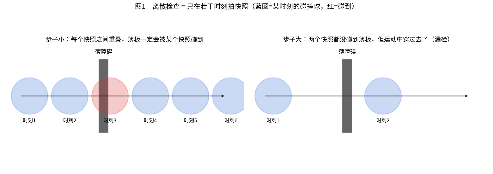
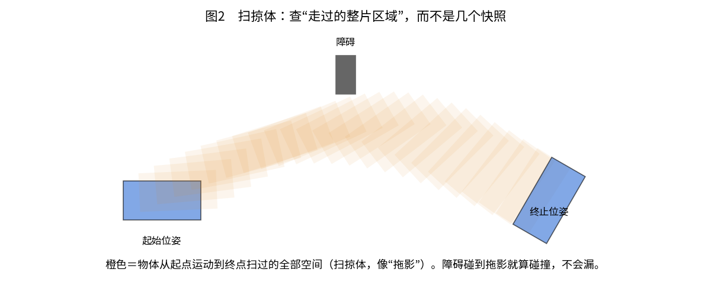
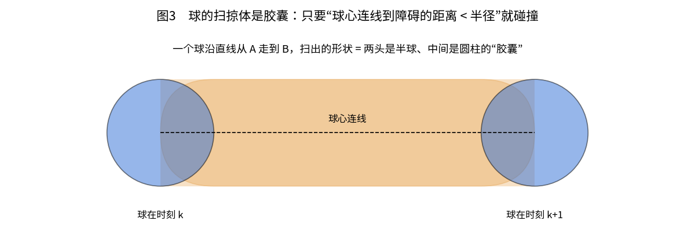
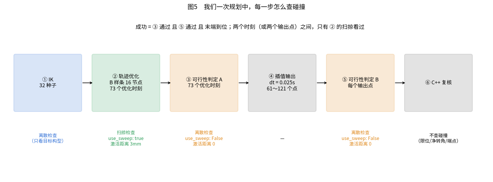
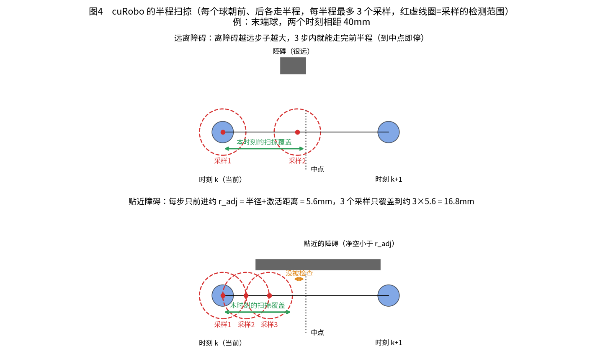
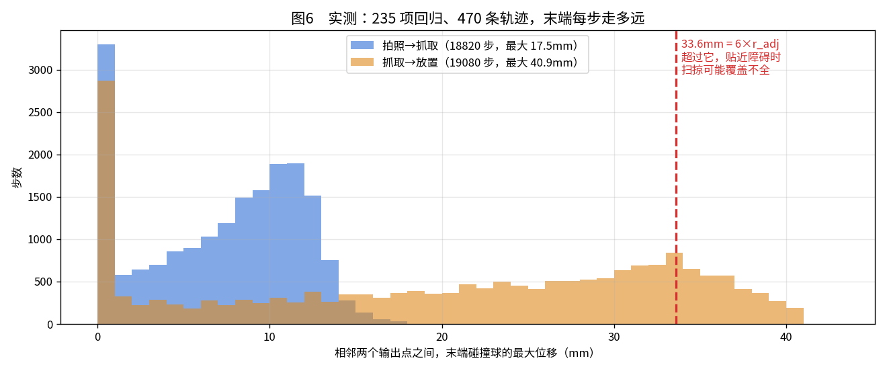
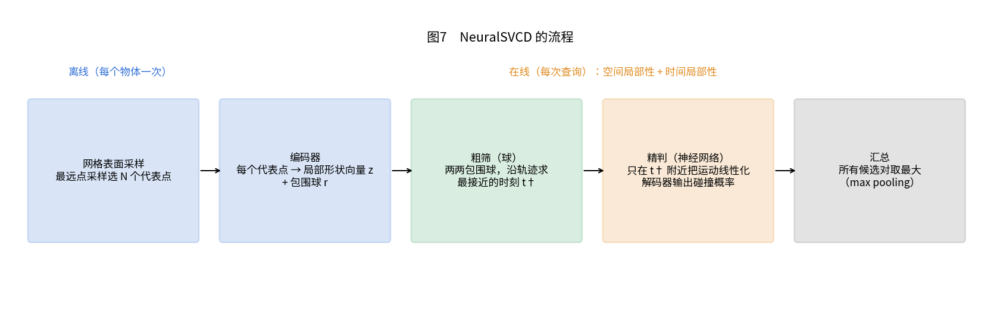

# 扫掠碰撞检测：从零讲起，到我们的代码，再到论文

> 本文是教学文档，不是方案文档。目的是把"扫掠"这件事讲清楚：它是什么、为什么需要、
> 我们的系统里实际怎么做的、有什么漏洞、论文（NeuralSVCD）又是怎么做的。
>
> 配图在同目录 `扫掠碰撞检测_教学_图/`。文中所有代码位置都已对照源码核实；
> 所有数字都注明了是实测、推算还是论文原文。单位：长度 mm，时间 s。

---

## 第一章　从零开始：碰撞检测为什么会"漏"

### 1.1 机器人的运动是怎么表示的

机器人在某一时刻的姿态，由 6 个关节角完全确定。一条轨迹，就是**按时间排好的一串关节角**：

```text
时刻:    0       0.025s    0.050s    0.075s   ...
关节角:  q0  →    q1   →    q2   →    q3   →  ...    （每个 q 是 6 个数）
```

我们发布给机器人的轨迹就是这种格式：每隔 0.025 秒一个点，一条轨迹 61～121 个点。

要判断某一时刻碰没碰，先做**正解**：由 6 个关节角算出每个连杆在空间里的位置，
进而算出每个碰撞球的球心在哪里（本体 191 个、末端 220 个，共 411 个球）。
然后每个球去查环境的距离场：球心离最近障碍还有多远（记为 d）。

```text
d < 球半径  →  这个球扎进障碍了  →  碰撞
```

### 1.2 离散检查：只在若干时刻"拍快照"

最直接的做法：**只在轨迹上的那些时刻点做上面的检查**，时刻点之间不管。
这就像给运动拍一串快照，每张快照里都没碰，就认为整段运动安全。



- **左图**：快照很密，相邻两个球互相重叠，任何夹在中间的障碍都至少会被一张快照碰到。
- **右图**：快照很稀，两张快照都没碰到薄板，但球从时刻 1 走到时刻 2 的**过程中**
  其实穿过了它。这种情况叫"穿隧"（tunneling），是离散检查的根本缺陷。

### 1.3 什么情况下会漏：一个简单的判断式

设一个球半径 r，检查时附加的安全距离（激活距离）为 η，相邻两个快照之间球心移动了 s，
一块厚度为 w 的薄板垂直挡在路上。两张快照里的"判撞范围"各向前后延伸 r + η，
加上板本身的厚度，**要保证至少一张快照碰到板**，需要：

```text
s ≤ 2 × (r + η) + w
```

反过来，**s > 2(r + η) + w 时就可能漏**。例子（末端球 r = 2.6mm）：

| 检查时用的安全距离 η | 板厚 w | 不漏的最大步长 2(r+η)+w |
| ---: | ---: | ---: |
| 0（我们最终判定用的值，见 3.3） | 5mm | 10.2mm |
| 0 | 20mm | 25.2mm |
| 3mm（我们优化时用的值） | 5mm | 16.2mm |
| 3mm | 20mm | 31.2mm |

结论：**球越小、障碍越薄、每步走得越远，越容易漏。** 末端球只有 2.6mm 半径，
是最容易漏的部位。本体球最小也有 10～18mm，大得多。

### 1.4 扫掠体：查"走过的整片区域"

要彻底不漏，就不能只看快照，而要看物体在两个时刻之间**扫过的全部空间**，这叫**扫掠体**：



扫掠体就像运动留下的"拖影"。只要障碍碰到拖影，就算碰撞，一定不会漏。
难点在于：连杆一边平移一边转动，拖影的形状非常复杂，精确算出来很慢。
下一章讲几种常见的做法。

---

## 第二章　扫掠检查的几种做法

### 2.1 加密快照

最朴素：两个时刻之间多插几个快照，插到间距满足 1.3 的判断式为止。
准，但代价和插入的数量成正比。快照越密越慢。

### 2.2 球的扫掠：胶囊

如果机器人用球来表示，事情就简单多了：**一个球沿直线运动扫出的形状是"胶囊"**，
两头是半球，中间是圆柱。



判断胶囊碰没碰障碍，等价于：**球心连线（一条线段）上，有没有哪个点离障碍的距离小于半径。**

在距离场里，没法一次直接算出"一条线段离障碍多远"，所以还是要沿线段取点。
但可以聪明地取：**球面追踪**（sphere tracing）。

```text
在线段上某点查距离场，得到"离最近障碍还有 d"
→ 以这个点为圆心、d 为半径的一圈里一定没有障碍
→ 沿线段往前跳 d − r，跳过的这一段肯定安全，不会漏
→ 在新位置再查，再跳……
```

离障碍远的地方 d 大，一步就能跳很远；靠近障碍时 d 小，步子自动变小、看得更细。
这样用很少的查询次数就能把整条线段检查完。

### 2.3 保守包络

用一个简单的大形状（凸包、包围盒）把整段运动罩住，然后检查包络碰没碰障碍。
很快，但包络比真实拖影大，会把没碰的判成碰了（误判）。
论文里提到的"凸包 + GJK 算法"属于这一类，而且只有纯平移时才精确，转动时有误差。

### 2.4 连续碰撞检测：求最危险的时刻

对整段运动，直接求"两个物体距离最近（或扎得最深）的那个时刻"，再在那个时刻做精确检查。
最精确，但对复杂形状要做数值优化，很慢。论文里叫"隐函数 + 时间优化"，用来当真值。

### 2.5 对比

| 做法 | 会不会漏 | 会不会误判 | 速度 | 谁在用 |
| --- | --- | --- | --- | --- |
| 离散快照（稀） | **会** | 不会 | 最快 | 我们的最终判定（3.3） |
| 加密快照 | 足够密就不会 | 不会 | 慢，随密度增加 | — |
| 球的扫掠（胶囊 + 球面追踪） | 采样够就不会 | 不会 | 快 | **cuRobo 轨迹优化（3.2）** |
| 保守包络（凸包 + GJK） | 不会 | **会** | 中，GPU 不友好 | TrajOpt |
| 连续检测（求最危险时刻） | 不会 | 不会 | 很慢 | 用作真值 |
| NeuralSVCD（第四章） | 很少 | 很少 | 很快 | 论文方法 |

---

## 第三章　我们项目里是怎么做的

### 3.1 一次规划中，每一步怎么查碰撞



| 步骤 | 做什么 | 怎么查碰撞 | 代码位置 |
| --- | --- | --- | --- |
| ① IK | 32 个种子求目标关节角 | 只查目标构型这一个姿态（离散） | `services/curobo_planner/_vendor/curobo_adapter.py:248` |
| ② 轨迹优化 | 4 条种子并行优化，B 样条 16 个节点，在 **73 个优化时刻**上算代价 | **扫掠**（`use_sweep: true`），激活距离 3mm | 同上 `:295`；配置见 3.2 |
| ③ 可行性判定 A | 检查 73 个优化时刻 | 离散，激活距离 **0** | cuRobo `solver_trajopt.py:418` |
| ④ 插值输出 | 按 0.025s 采样成 61～121 个点 | — | cuRobo `solver_trajopt.py:428` |
| ⑤ 可行性判定 B | 检查每一个输出点 | 离散，激活距离 **0** | cuRobo `solver_trajopt.py:485～507` |
| ⑥ C++ 复核 | 限位、净转角、端点 | **不查碰撞** | `src/pipeline/stage/trajectory/plan_full_cycle_stage.cpp`（[5.2]） |

**一条轨迹算成功** = ③ 通过 **且** ⑤ 通过 **且** 末端到位
（cuRobo `solver_trajopt_result.py:155` 与 `:207`）。

**一句话总结**：两个相邻时刻之间的那段运动，**只有 ② 的扫掠看过**；而 ② 是优化时用的
"代价"（推着轨迹离开障碍），不是最终的通过/不通过判定。最终判定 ③⑤ 都只看快照。

### 3.2 轨迹优化里的扫掠：逐段讲代码

**（1）扫掠是从哪里打开的**

我们的适配器在 `curobo_adapter.py:77` 调用 `MotionPlannerCfg.create(...)` 时，没有指定轨迹优化的配置，
所以用的是 cuRobo 默认值（cuRobo `_src/motion/motion_planner_cfg.py:45～47`）：
`trajopt/lbfgs_bspline_trajopt.yml`。这份配置里（第 43～44 行）：

```yaml
scene_collision_cfg:
  activation_distance: 0.0025   # 会被我们的 3mm 覆盖，见下
  use_speed_metric: true
  use_sweep: true               # ← 开启扫掠
  use_sweep_kernel: true        # ← 用专门的 GPU 核函数
  weight: 100000.0
```

激活距离：我们通过 `optimizer_collision_activation_distance` 传入 3mm。
cuRobo 只把它应用到**优化器**的代价上（`_src/solver/solver_core_cfg.py:112`），
③⑤ 两次可行性判定用的是 `metrics_base.yml` 自己的值 0。

**（2）在离散和扫掠之间二选一**

cuRobo `_src/cost/cost_scene_collision.py:81`：

```python
if self.config.use_sweep:
    return self._sweep_fn(...)       # 扫掠
else:
    return self._discrete_fn(...)    # 离散
```

**（3）扫掠核函数在做什么**

核函数在 `_src/geom/collision/wp_sweep_collision_kernel.py:84` 起，每个 GPU 线程负责
"某条轨迹、某个时刻、某个球"。逻辑翻译成中文伪代码：

```text
r_adj = 球半径 + 激活距离                    # 末端球：2.6 + 3 = 5.6mm

① 在当前时刻 k 的球心位置查一次距离场，扎进去了就累加代价和梯度

② 朝前一时刻 k−1 扫半程（第 188 行起）：
     half = |球心(k−1) − 球心(k)| / 2         # 只走到中点
     jump = 0
     重复最多 SWEEP_STEPS = 3 次（第 75 行）：
         如果 jump ≥ half：停（半程已走完）
         取点 = 从球心(k) 朝球心(k−1) 走 jump 的位置（直线插值）
         查距离场 → 穿透量 = r_adj − d
         如果扎进去了：累加代价和梯度；jump += 穿透量
         否则：        jump += max(d − r_adj, r_adj)   # 第 222 行，球面追踪的步长

③ 朝后一时刻 k+1 同样扫半程（第 224 行起）

④ 把累加的代价、梯度写回
```

要点：
- **每个时刻只管自己两侧各半程**，中点另一侧由相邻时刻负责，拼起来覆盖整段。
- **步长是球面追踪**：离障碍越远（d 越大），一步跳得越远。
- 但有一个**下限**：步长至少是 r_adj，所以贴着障碍时不会停在原地。
- 也有一个**上限**：每个半程最多 3 个采样点（`SWEEP_STEPS = 3`，编译期常量）。

代价函数（`_src/geom/collision/wp_collision_common.py:12`）：穿透量小于 η 时用二次函数，
大于 η 时用线性函数，保证代价和梯度都是连续的，优化器才好推。

**（4）3 个采样点能管多远：33.6mm 是怎么来的**



- **远离障碍时**（上图）：d 很大，第二个采样点就跳到了中点，前半程一次检查完，没问题。
- **贴近障碍时**（下图，净空小于 r_adj）：每步只能前进 r_adj，3 个采样点分别在
  0、r_adj、2·r_adj 处，每个采样点再往外管 r_adj，所以**半程最多管到约 3·r_adj**。

要让贴近障碍时整段也能被检查完，需要半程 ≤ 3·r_adj，也就是：

```text
相邻两个优化时刻之间，球心移动距离 ≤ 6 × r_adj
末端球：6 × 5.6 = 33.6mm
本体球：最小半径 10.1mm（wrist3）→ 6 × (10.1 + 3) ≈ 79mm 以上
```

超过这个距离、又恰好贴着障碍时，线段中间会有一小段没被扫掠看到（图 4 下图橙色部分）。
这是由代码推出来的覆盖上限，属于推算。

### 3.3 最终可行性判定为什么是离散的

`metrics_base.yml` 第 10 行：`use_sweep: False`，`activation_distance: 0.0`。
③ 用它检查 73 个优化时刻，⑤ 用它检查插值出来的每一个输出点。

判据是"球心离障碍的距离 < 球半径"，也就是**真的扎进去才算失败**，不带 3mm 余量。
3mm 余量只在 ② 的优化代价里起作用：它让优化器尽量把轨迹推到离障碍 3mm 以外，
但最终判定只要求"每个检查点上没扎进去"。

### 3.4 插值：从 73 个优化时刻到 0.025s 的输出点

轨迹优化不直接优化每个输出点，而是优化一条 **B 样条曲线**的 16 个控制节点
（`trajopt/transition_bspline_trajopt.yml`：`n_knots: 16`，`interpolation_steps: 4`）。
优化时在这条曲线上取 (16 + 2) × 4 + 1 = **73 个时刻**算代价
（`_src/transition/fns_state_transition.py:327`）。

优化完后，在同一条 B 样条上按 0.025s 重新采样，得到发布的输出点
（插值方式 `BSPLINE_KNOTS_CUDA`）。所以：
- 输出点和优化时刻在**同一条曲线**上，只是取点的疏密不同；
- 扫掠在两个优化时刻之间用的是**球心直线连线**，而真实运动是关节空间的曲线经过正解，
  两者略有偏差。相邻时刻很近时，偏差很小。

### 3.5 C++ 复核查了什么

C++ 的 [5.2] 运动学复核只查：六轴限位、净转角、首末端点和期望位姿是否吻合。
**不做任何碰撞检查**，所以它补不了上面的漏洞。

### 3.6 用实测数据看我们的风险

统计对象：本体 191 球新方案下，随机 235 项回归的全部 470 条输出轨迹（会话 `20260930_051459_472`）。



**相邻两个输出点之间，末端碰撞球的最大位移**（实测）：

| 段 | P50 | P99 | 最大 |
| --- | ---: | ---: | ---: |
| 拍照 → 抓取 | 8.2mm | 15.2mm | 17.5mm |
| 抓取 → 放置 | 22.5mm | 40.0mm | 40.9mm |

**相邻两个优化时刻之间，末端碰撞球的最大位移**（推算：把输出轨迹按 73 个均匀时刻重采样估算）：

| 段 | P50 | P99 | 最大 | 超过 33.6mm 的步数 |
| --- | ---: | ---: | ---: | ---: |
| 拍照 → 抓取 | 9.2mm | 15.7mm | 17.1mm | **0** / 16920 |
| 抓取 → 放置 | 25.7mm | 44.5mm | 45.4mm | **5380** / 16920（32%） |

对照前面两条规则：

- **拍照 → 抓取（靠近料框的那一段）**：优化时刻之间最多 17.1mm，**小于 33.6mm**，
  即使贴着障碍，扫掠也能把每一段完整检查到。这一段是安全的。
- **抓取 → 放置**：约三分之一的优化步超过 33.6mm。
  - 如果这时末端恰好贴着障碍，线段中间会有一小段没被扫掠看到；
  - 最终判定只看输出点（相邻最多 40.9mm）、而且不带余量。按 1.3 的判断式，
    厚度小于约 40.9 − 2 × 2.6 ≈ 36mm 的薄障碍，理论上可能夹在两个输出点之间被漏掉。
  - 放置段一般远离料框，实际有没有障碍要看放置路径附近的现场环境。
- **本体球**：每步最多移动 39mm 左右，远小于它们约 79mm 以上的覆盖上限，不是问题。

1173 项和 235 项回归都没有出现碰撞失败。但回归统计的是"规划是否成功"，
并不能证明执行时两点之间没有擦碰，所以上面的分析不能用回归结果直接否定。

### 3.7 可以怎么补（讨论选项，本文不下结论）

| 选项 | 做法 | 优点 | 代价 |
| --- | --- | --- | --- |
| A. 发布前加密复核 | 对最终选中的 1 条轨迹，在相邻输出点之间插值到每步 ≤ 1～2mm，所有球查一次距离场 | 不改 cuRobo，规划器照旧；只查 1 条轨迹 | GPU 上约几十毫秒（推算）；需要新写一段复核代码 |
| B. 加大 `SWEEP_STEPS` | 把 3 改成 5～8，贴近障碍时每半程看得更远 | 优化阶段就把整段看全 | 要改 cuRobo 源码里的编译期常量；优化变慢 |
| C. 增加优化时刻 | 加大 `n_knots` 或 `interpolation_steps` | 每步变短 | 优化明显变慢 |
| D. 先离线量化风险 | 用归档的 tiff 重建碰撞世界，对 235 项轨迹做 A 的加密检查，看有没有"点上安全、中间穿透" | 不改任何代码，先拿数据 | 一次离线计算 |

---

## 第四章　论文是怎么做的：NeuralSVCD

论文：*NeuralSVCD for Efficient Swept Volume Collision Detection*，
Dongwon Son、Hojin Jung、Beomjoon Kim（KAIST），CoRL 2025，arXiv 2509.00499。

### 4.1 它要解决的问题

和第一章一样：离散检查会穿隧漏检。论文把问题定义为**扫掠体碰撞检测（SVCD）**：
给定一个运动物体沿轨迹 τ(t) 运动、一个静止物体，求整段运动中的**最大穿透深度**。

它对现有做法的评价（论文第 2 节）：
- **凸包 + GJK**：只有纯平移时精确；GJK 分支多，不适合 GPU 并行。
- **球（cuRobo 的做法）**：GPU 并行好、开销随球数线性增长；但对**薄的、凹的**形状，
  要用大量的球才能贴合，否则精度差。
- **隐函数 + 时间优化**：精确，但每个表面点都要单独做一次时间优化，太慢。

### 4.2 核心思路：两个"局部性"

- **空间局部性**：碰撞只发生在两个物体靠近的那一小块区域。不同形状的物体，
  局部接触区域往往很像。所以只看局部形状，就能对没见过的物体也判断得准。
- **时间局部性**：碰撞只和轨迹里很短的一段有关。找到最危险的那个时刻，
  只看那附近的一小段运动就够了，不用看整条轨迹。

### 4.3 具体流程



**离线编码（每个物体做一次）**
1. 在物体网格表面采样，用最远点采样选出 N 个**代表点**。
2. 编码器把每个代表点周围的局部形状压成一个**局部形状向量 z**。
3. 每个代表点配一个**包围球**，半径 = α × 到最近相邻代表点的距离（α > 1），保证把局部几何罩住。

**在线查询（每次判断一段运动）**
1. **粗筛（用包围球）**：对每一对（静止物体的代表点 i，运动物体的代表点 j），
   用牛顿法求 `min_t  dist(p_i, τ(t)·p_j) − r_i − r_j`，
   得到两球**最接近的时刻 t†**。结果为负的才进入下一步。
2. **精判（用神经网络）**：在 t† 附近把运动**线性化**成一个 6 维速度（平移 + 转动），
   把（静止物体的 z、运动物体的 z、t† 时刻的位姿、局部运动）一起送进解码器，
   输出**碰撞概率**。
3. **汇总**：所有候选对的概率取最大值，作为整段运动的结果。

**训练**：2556 个物体网格（GoogleScannedObjects、ObjaverseXL、NOCS），随机配对、
随机直线轨迹，用 FCL 库算真值标签，二分类交叉熵损失，加一项正则让输出能反映穿透程度。

### 4.4 论文结果（原文数据）

**扫掠检测本身**（9 自由度 UR5 加移动底盘）：
- 每次查询 6.4×10⁻⁵ 秒就能达到 90% 准确率；最高 95.6%（训练集里的物体）/ 94.9%（没见过的物体）。
- 凸包 + GJK 的两个版本分别慢 120 倍、590 倍；球的连续扫掠慢 24 倍。

**接进 cuRobo 轨迹优化器**（每个任务 500 次随机试验）：

| 任务 | 机器人 | 方法 | 成功率 | 规划时间 | 最大穿透 |
| --- | --- | --- | ---: | ---: | ---: |
| 插碗架 | UR5（6 轴） | cuRobo 50 球 | 73.6% | 9.99s | 3.73mm |
| | | cuRobo 400 球 | 95.0% | 12.35s | 0.5mm |
| | | **cuRobo + NeuralSVCD** | **99.3%** | **9.64s** | **0.01mm** |
| 双臂插孔 | ARMADA（12 轴） | cuRobo 1200 球 | 84.9% | 12.45s | 1.03mm |
| | | **cuRobo + NeuralSVCD** | **92.8%** | **2.92s** | **0.33mm** |
| 矿井导航 | 移动 UR5（9 轴） | cuRobo 2000 球 | 83.8% | 60.91s | 5.32mm |
| | | **cuRobo + NeuralSVCD** | **92.2%** | **9.84s** | **3.81mm** |

增加 cuRobo 的球数也能接近它的成功率，但要多花 1.3～6.2 倍时间。

### 4.5 论文自己写的局限

1. **输出的是碰撞概率，不是距离**：优化器需要距离和梯度，论文用概率的 logit 近似距离，
   偏差可能让优化陷入局部最优。
2. **需要完整的网格**：场景、机器人连杆、被抓物体都要有网格。原始传感器数据（点云、图像）
   还不能直接用，论文列为未来工作。
3. 需要训练；作为神经网络，**没有保证不漏的误差上界**。

### 4.6 和 cuRobo 扫掠的对比

| | cuRobo 球扫掠（我们在用） | NeuralSVCD |
| --- | --- | --- |
| 机器人表示 | 碰撞球 | 网格 → 代表点 + 局部形状向量 |
| 环境表示 | 距离场（可由点云建，我们就是） | **网格**（暂不支持点云） |
| 两时刻之间 | 球心直线 + 球面追踪，每半程最多 3 个采样 | 求最危险时刻 t†，在那里精判 |
| 输出 | 距离与梯度 | 碰撞概率（logit 当距离用） |
| 是否需要训练 | 不需要 | 需要 |
| 误差上界 | 由球的覆盖和采样决定，可推算 | 没有 |

### 4.7 对我们的意义

- 它解决的问题我们确实有（3.6 节放置段的步长），但**我们的环境是深度相机点云**，
  它目前要求场景是网格，不能直接用。
- 我们的风险集中在一个可以量化的地方：末端球 + 放置段大步长。用 3.7 节的选项 A 或 D
  就能低成本地查清或补上，不需要引入神经网络。
- 值得借鉴的是它的思路：**先用球粗筛，只在"最危险时刻"附近做精细检查**。
  如果以后要做选项 A 的加密复核，也可以先找出每段离障碍最近的时刻，只在那附近加密，进一步省时间。

---

## 附录 A　代码位置速查

| 内容 | 位置 |
| --- | --- |
| 我们创建规划器（未指定轨迹优化配置） | `services/curobo_planner/_vendor/curobo_adapter.py:77` |
| 我们调用 IK / 轨迹优化 | 同上 `:248` / `:295` |
| 默认轨迹优化配置 | cuRobo `_src/motion/motion_planner_cfg.py:45～47` |
| 扫掠开关 | cuRobo `content/configs/task/trajopt/lbfgs_bspline_trajopt.yml:43～44` |
| 最终判定配置（离散、激活 0） | cuRobo `content/configs/task/metrics_base.yml:10` |
| 激活距离只作用于优化器 | cuRobo `_src/solver/solver_core_cfg.py:112` |
| 离散 / 扫掠二选一 | cuRobo `_src/cost/cost_scene_collision.py:81` |
| 扫掠核函数 | cuRobo `_src/geom/collision/wp_sweep_collision_kernel.py:84` |
| 每半程采样数 `SWEEP_STEPS = 3` | 同上 `:75` |
| 球面追踪步长 | 同上 `:222`、`:254` |
| 碰撞代价（二次 / 线性） | cuRobo `_src/geom/collision/wp_collision_common.py:12` |
| B 样条节点与插值步数 | cuRobo `content/configs/task/trajopt/transition_bspline_trajopt.yml` |
| 优化时刻数公式 | cuRobo `_src/transition/fns_state_transition.py:327` |
| 判定 A（73 个优化时刻） | cuRobo `_src/solver/solver_trajopt.py:418` |
| 插值并判定 B（输出点） | 同上 `:428`、`:485～507` |
| 成功 = A 且 B 且到位 | cuRobo `_src/solver/solver_trajopt_result.py:155`、`:207` |

（cuRobo 路径均在 `third_party/curobo/curobo/` 下。）

## 附录 B　名词表

| 名词 | 意思 |
| --- | --- |
| 离散检查 | 只在若干时刻检查碰撞，时刻之间不管 |
| 穿隧（tunneling） | 两个检查时刻之间穿过障碍、却没被发现 |
| 扫掠体 | 物体在一段运动中扫过的全部空间 |
| 胶囊 | 一个球沿直线运动扫出的形状 |
| 球面追踪 | 沿线段走，每次跳"离障碍的距离"那么远，保证不跳过障碍 |
| 激活距离 η | 球面离障碍还有这么远时，代价就开始变成非零（相当于把球再胖 η） |
| r_adj | 球半径 + 激活距离；扫掠核函数里的"有效半径" |
| B 样条 | 用少量控制节点描述一条光滑曲线；轨迹优化优化的是这些节点 |
| 优化时刻 | 优化时在曲线上取来算代价的 73 个时刻 |
| 输出点 | 按 0.025s 采样、发布给机器人的轨迹点 |
| SVCD | 扫掠体碰撞检测（Swept Volume Collision Detection） |

## 参考

- NeuralSVCD：<https://arxiv.org/abs/2509.00499>，项目主页 <https://neuralsvcd.github.io/>
- cuRobo：Sundaralingam et al., *cuRobo: Parallelized Collision-Free Robot Motion Generation*, ICRA 2023
